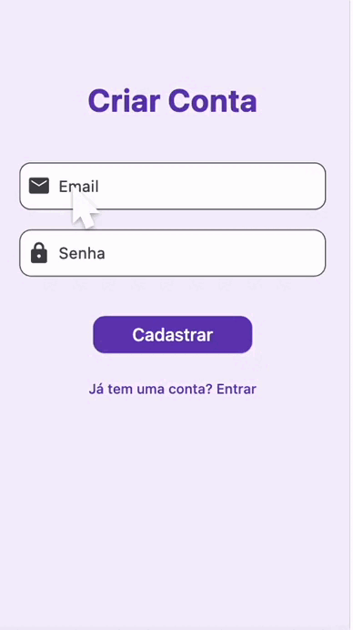

# 📘 English Dictionary App

Um app de dicionário inglês desenvolvido com **Flutter** e integração com **Firebase**.  
Permite cadastro, login com verificação de e-mail, visualização de palavras e possibilidade ouvir a pronúncia. 

---

## 🧱 Estrutura de Pastas

lib/ 

├── main.dart # Entrada principal do app 

├── register_page.dart # Tela separada de registro

└── dictionary_page.dart # Tela principal do dicionário

## 🚀 Funcionalidades

- 🔐 **Autenticação Firebase**
- 📖 **Consulta de palavras** em inglês com os possíveis significados em inglês 
- 🧠 Interface intuitiva e responsiva
- 🎨 Design simples e elegante
---

## ⚙️ Como rodar o projeto

1. Clone o repositório:

```bash
git clone [https://github.com/seu-usuario/seu-repositorio.git](https://github.com/Aghelena/dictionary)
cd seu-repositorio
Instale os pacotes:

flutter pub get
Configure o Firebase:

Crie um projeto no Firebase Console

Ative Authentication > Email/Password

Copie as configurações para o arquivo firebase_options.dart

Execute o app:

flutter run

📦 Dependências Principais
firebase_core

firebase_auth

```


App em funcionamento:


